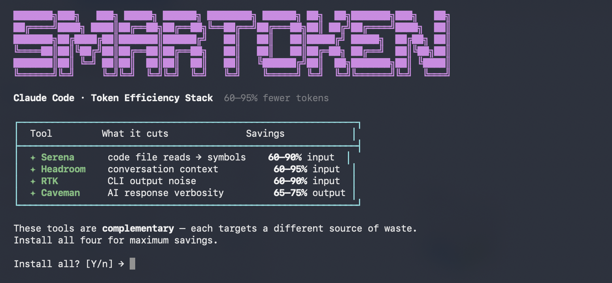
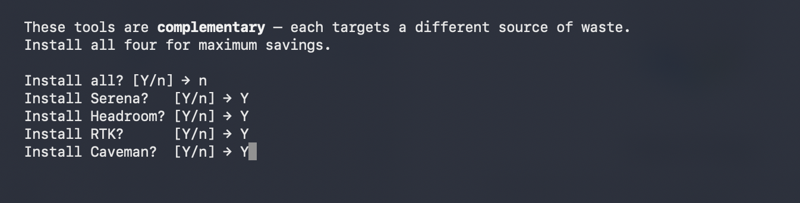
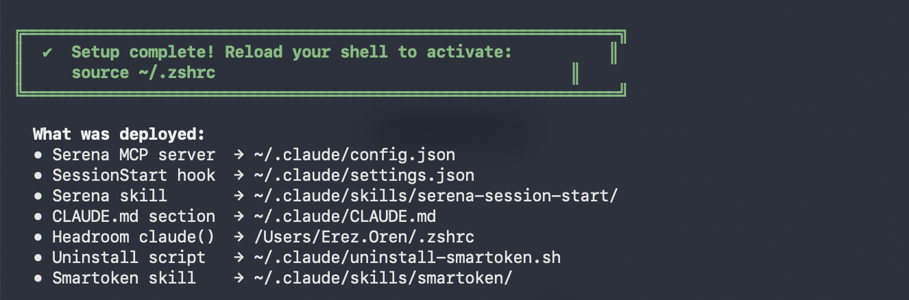

# smartoken

One-command setup that installs a four-tool token efficiency stack for Claude Code.
**60–95% fewer tokens** on everyday dev tasks — without changing your workflow.



---

## The Stack

Each tool attacks a different source of token waste. Use all four together.

| Tool | What it cuts | Savings |
|------|-------------|---------|
| **Serena** | Code file reads → targeted symbol lookups | 60–90% input tokens |
| **Headroom** | Conversation context compression | 60–95% input tokens |
| **RTK** | CLI output noise (git, test runners, grep, find) | 60–90% input tokens |
| **Caveman** | AI response verbosity (terse "caveman" speech mode) | 65–75% output tokens |

---

## Prerequisites

Install these **before** running the installer.

| Requirement | Status | Mac/Linux | Windows |
|-------------|--------|-----------|---------|
| [Claude Code](https://claude.ai/code) | **Required** | `npm install -g @anthropic-ai/claude-code` | same |
| Python 3.10+ | **Required** | `brew install python3` | [python.org](https://www.python.org/downloads/) |
| Node ≥18 | Caveman only | `brew install node` | [nodejs.org](https://nodejs.org/) |

> **No brew?** Install it first: `/bin/bash -c "$(curl -fsSL https://raw.githubusercontent.com/Homebrew/install/HEAD/install.sh)"`

The installer handles everything else (uv, Serena MCP, headroom-ai, RTK binary) automatically.

---

## Install

### Mac / Linux

```bash
cd smartoken
./install.sh
```

### Windows

Open PowerShell as Administrator:

```powershell
cd smartoken
powershell -ExecutionPolicy Bypass -File install.ps1
```

The installer shows a menu — press **Enter** to install all four, or choose individually.





---

## Uninstall

### Mac / Linux

```bash
cd smartoken
./uninstall.sh
```

### Windows

```powershell
cd smartoken
powershell -ExecutionPolicy Bypass -File uninstall.ps1
```

Or use the script the installer placed in `~/.claude/`:

```bash
~/.claude/uninstall-smartoken.sh        # Mac/Linux
```
```powershell
& "$env:USERPROFILE\.claude\uninstall-smartoken.ps1"   # Windows
```

The uninstaller shows the same menu — press **Enter** to remove all four, or choose individually.

> After full uninstall, two small files remain: `~/.claude/uninstall-smartoken.sh` and `~/.claude/skills/smartoken/`. Delete them manually if you want a clean slate.

---

## How each tool works after install

### Serena
At the start of each Claude session you'll be asked:
```
🔵 SERENA MCP — Activate for token-efficient code navigation? [y/n]
```
Say **y** to activate. Serena navigates your codebase using symbol trees instead of reading full files.

### Headroom
When you open Claude from the terminal, you'll be asked once per project:
```
🚀 HEADROOM  60-95% fewer tokens via wrap mode
   Activate for this session? [y/always/n] →
```
- **y** — enabled for this session
- **always** — auto-enables for this project from now on
- **n** — skip, open plain Claude

### RTK
Transparent — runs automatically via a Claude Code hook. Every Bash command output is filtered before it hits Claude's context. Check your savings with:
```bash
rtk gain
```

### Caveman
Trigger with `/caveman` or say "talk like caveman" in any session.
Stop with "normal mode". Intensities: `lite`, `full` (default), `ultra`.

---

## What gets installed

| Component | Location |
|-----------|----------|
| Serena MCP server config | `~/.claude/config.json` |
| SessionStart hook | `~/.claude/settings.json` |
| Serena skill file | `~/.claude/skills/serena-session-start/` |
| Caveman skill file | `~/.claude/skills/caveman/` |
| CLAUDE.md instructions | `~/.claude/CLAUDE.md` |
| RTK binary | `~/.local/bin/rtk` |
| RTK Claude Code hook | `~/.claude/settings.json` |
| Headroom `claude()` wrapper | `~/.zshrc` / `~/.bash_profile` / PowerShell profile |
| Uninstall script | `~/.claude/uninstall-smartoken.sh` (or `.ps1`) |
| Smartoken skill | `~/.claude/skills/smartoken/` |

The installer is **idempotent** — safe to run multiple times.
